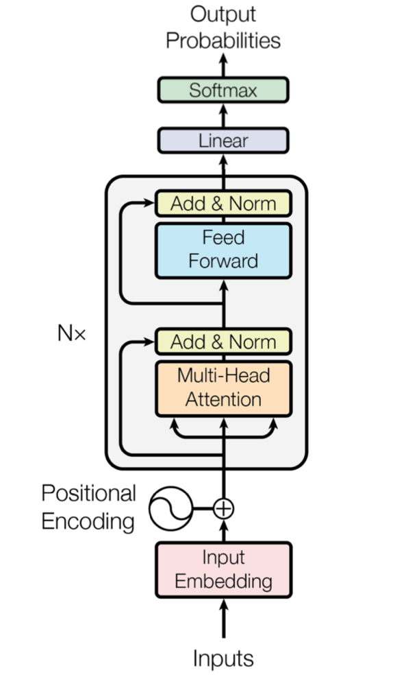

# Fake Academic Paper Generation Project
inzva AI Projects #2 - Fake Academic Paper Generation Project

## Project Description

In this project, we aim to use the LaTeX source files of open access papers on arXiv
as a dataset and feed it into a neural network to be able to generate realistic
looking academic papers. We chose the character based recurrent neural network (RNN)
model used by Andrej Karpathy in his blog post as our baseline [1]. We will try to improve
the baseline results of the char-RNN model by applying transformers and attention
mechanism [2]. We also want to try GANs to generate realistic LaTeX code. [3]

## Dataset

### Dataset Preparation
To the best of our knowledge there was no available dataset compiled from academic papers. Therefore we decided to prepare a dataset from academic papers on arxiv.org. 

All scripts related to the dataset preparation can be found in the **dataset_generation** directory.

#### Steps for the dataset preparation:
##### 1) Select a subset of academic papers on arxiv.org  
We selected Computer Vision as the topic of interest for the dataset. Therefore, we crawled arxiv.org to find papers tagged as Computer Vision between 2015 - 2018. (BeautifulSoup is used as html parser)

related scripts: 
* **dataset_generation/crawler.py** (crawles arxiv.org as specified and writes the result to **paperlinks.txt**)
* **dataset_generation/random_paper_sampler.py** (samples examples from **paperlinks.txt** and writes the result to **selected_papers.txt**)

##### 2) Download the source files
We downloaded the source files as tar files for the selected papers and untar/unzip them.

related script: **dataset_generation/downloader.py** (reads selected papers from **selected_papers.txt**, downloads the source files and untar/unzip them)

##### 3) Find the latex source files for each paper and Compile each paper into one latex file
We resolved \include, \input kind of import statements in latex source files in order to compile each paper into one latex file and wrote a latex file for each paper. 

related script: **dataset_generation/latex_input_resolver.py** (Finds the latex files from the source files, reads the content using TexSoup, finds the root files(files including documentclass statement), recursively replaces the import statements with the content of the imported file, and writes a latex file for each paper.)

##### other helper scripts:
* **dataset_generation/complete_dataset.py** (kind of combination of all these scripts which finds problematic source files and replaces them with other papers from the **paperlinks.txt**)
* **dataset_generation/renumber_paper.py** (renames the papers like 0.tex, 1.tex, 2.tex so on)

Using this specified process, we downloaded 4-5 GB source files for papers since source files include images etc. which are not need for our purpose. At the end, we have 799 latex files each for an academic paper. Before preprocessing, this is approximately equal to 46 MB of latex. 

#### License for the dataset
* Papers are licensed under one of Creative Common licenses. For details: https://arxiv.org/help/license
* The papers in the dataset are listed in **dataset_generation/selected_papers.txt**. The list can be used to give credit to the papers in the dataset.

### Preprocessing
Dataset is needed to be preprocessed because of noise such as created by comments and non-UTF characters. Therefore, we used _preprocess_char.py_ to delete comments and characters that used below a certain threshold, in our experiments it is 100. 

For our baseline model, we decided to use character level embedding. The details of the preprocessed char-based dataset is given below.

|         **Feature**         |  **Value** |
|:------------------------------:|:----------:|
| Number of Unique Token              |     102    |
| Number of Token                     | 37,921,928 |
| Lower-case to Upper-case Ratio |    23.95   |
| Word to Non-word Ratio         |    3.17    |

## Project Dependencies
- Tensorflow 1.12
- NumPy
- TexSoup (for dataset preparation)
- BeautifulSoup (for dataset preparation)

## Models

### Baseline Model
The rnn model described in the blog post "The Unreasonable Effectiveness of Recurrent Neural Networks"[1] 
#### How to Run:
After preparing the dataset, run **char-rnn.py** to train the model.

When training is over, run **generate_text.py**. This script will load the last
checkpoint and generate a number of characters using the learned parameters.

### Simplified Transformer Model
From Transformer Model [2], the parts related to translation problem is deleted.

#### How to Run:
After preparing the dataset, run **simplified_transformer/simplified_transformer.py** to train the model.

When training is over, run **simplified_transformer/generate_text.py**. This script will load the last
checkpoint and generate a number of characters using the learned parameters.

## References

[1] The Unreasonable Effectiveness of Recurrent Neural Networks
http://karpathy.github.io/2015/05/21/rnn-effectiveness/

[2] Vaswani, Ashish, et al. "Attention is all you need." *Advances in Neural Information Processing Systems*. 2017.

[3] Nie, Weili, Nina Narodytska, and Ankit Patel. "RelGAN: Relational Generative Adversarial Networks for Text Generation." (2018).
